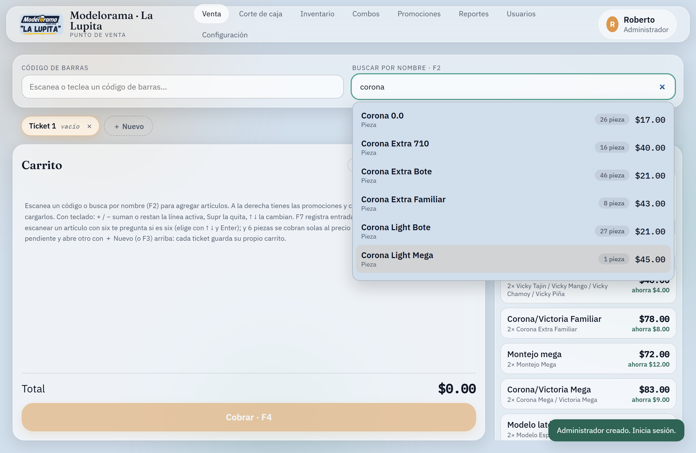
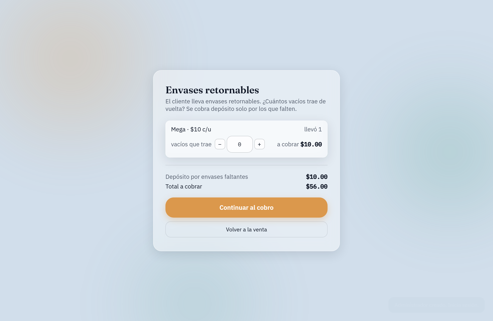
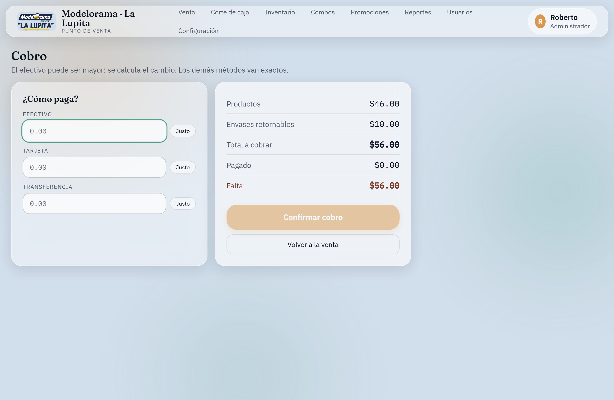
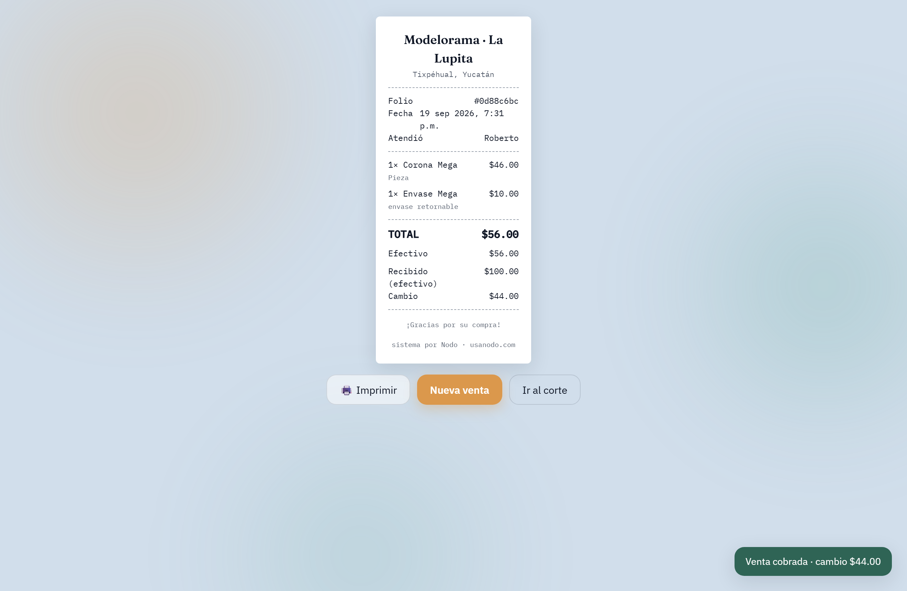
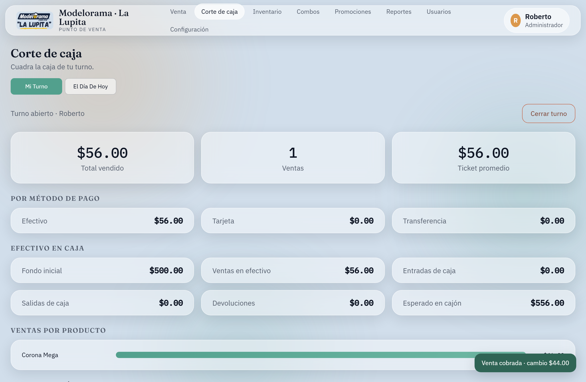
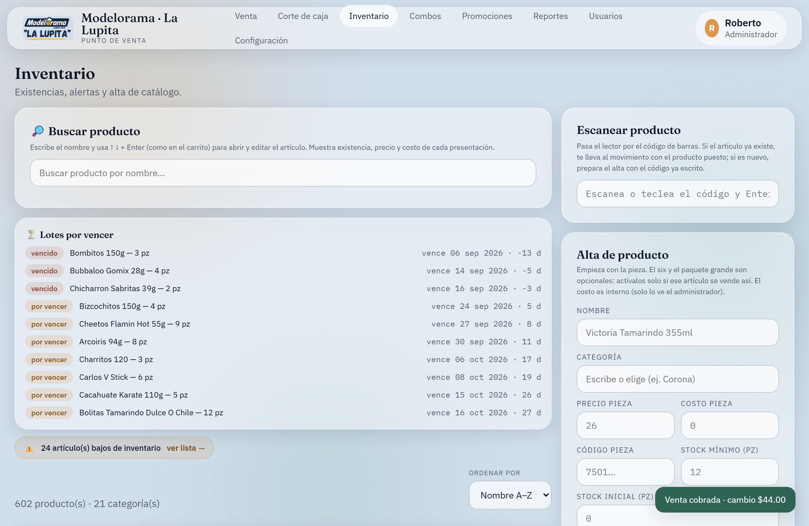
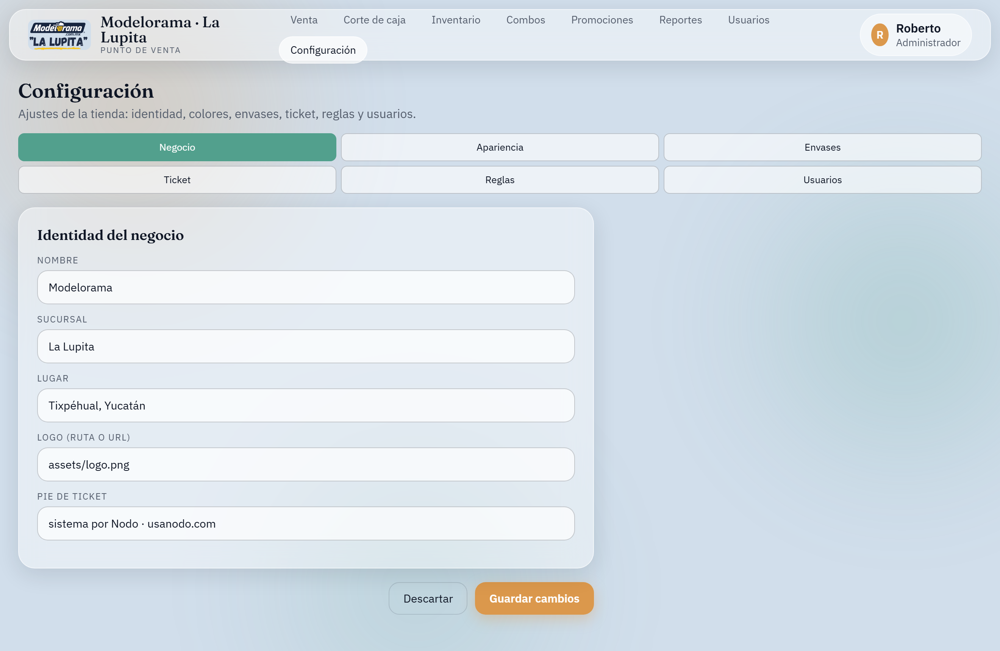

# Modelorama "La Lupita" — POS

*Demostración pública (100 % offline) del POS real de la tienda. · Public demo (100 % offline) of the store's real POS.*

> **Idioma / Language:** este README tiene ambos idiomas en secciones plegables (GitHub no
> permite un cambio "en vivo" con botón). Haz clic para expandir el que quieras. · This README
> keeps both languages in collapsible sections (GitHub can't do a live toggle). Click to expand.



<!-- ─────────────────────────────  ESPAÑOL  ───────────────────────────── -->
<details open>
<summary><b>🇲🇽 Español</b></summary>
   
### Mi rol en este proyecto
Soy analista de datos (no desarrollador web). Lo que es mío en este proyecto:
- Detecté el problema de datos y definí las **reglas de negocio** que el sistema debía respetar: multi-presentación con stock base único, depósito de envases retornables, promociones por cantidad y combos.
- Diseñé y **validé el modelo de datos** (esquema de Postgres/Supabase), revisando cada entrega antes y después de integrarla.
- Ejecuté la **migración** del catálogo real (602 productos con sus presentaciones, promociones y combos) desde el sistema anterior.

La **implementación técnica** (código de la app, triggers, RPC, capa offline) se construyó **asistida por IA bajo mi dirección y revisión**: yo especifiqué qué debía hacer, revisé el resultado y validé que la lógica de negocio y los cálculos fueran correctos.

## Qué es

**Demostración autocontenida de un punto de venta real en producción.** El sistema real
construido para la tienda Modelorama **"La Lupita"** (Tixpéhual, Yucatán) corre como **PWA
sobre Supabase** (Postgres + Auth + Edge Functions) y está **en uso en el mostrador**. Este
repositorio es una **build de demostración** de ese mismo proyecto, corriendo **100 % en el
navegador** (IndexedDB, sin backend ni credenciales), para **enseñar la funcionalidad real
sin exponer ni arriesgar el POS de producción**.

> Mismo front-end y mismo motor de precios que el sistema real; lo único que cambia es la
> **capa de datos** (nube → local). Por eso la demostración es **fiel** a la funcionalidad
> real con el **catálogo real** (602 productos) y a la vez **no puede comprometer la
> tienda**: aquí no hay credenciales, ni datos de producción, ni backend que tocar.

### El problema (del proyecto real)

La tienda necesitaba un punto de venta a la altura de su operación: catálogo grande con
**códigos de barras**, control de **inventario** (lotes y caducidad / FEFO), **cortes** por
turno y por día, **promociones, combos y envases retornables**, y **varios cajeros** con
roles (admin/cajero). Con dos restricciones propias del entorno:

1. **La venta no puede detenerse si se cae el internet.** La conexión en la zona es
   intermitente; en el mostrador se cobra a cada rato. El POS **debe seguir cobrando** con
   precios y promociones correctos y **cuadrar las cuentas** cuando la red vuelva.
2. **Tiene que poder replicarse por tienda** (multi-sucursal) sin rehacer el sistema, y
   **proteger los datos** (cada quien ve solo lo que le toca).

### La solución (el sistema real)

- **PWA instalable sobre Supabase** (Postgres + **RLS** + Auth + Edge Functions), sin
  framework ni bundler. Se instala como app de escritorio y se hostea en Vercel.
- **La lógica de negocio crítica vive en la base** (triggers + el RPC `registrar_venta`):
  venta atómica, descuento de inventario con **FEFO**, total = suma de subtotales, validación
  de pagos y devoluciones. La app usa solo la *anon key*; la privacidad la garantiza RLS.
- **Modo sin conexión**: cachea el catálogo, **encola** las ventas descontando el stock local
  y, al volver la red, las **reinyecta sin duplicarlas**.
- **Multi-tienda** (un proyecto Supabase por sucursal) y **gestión de usuarios** por rol.

### Por qué esta versión de demostración

Enseñar el POS real a un cliente nuevo o a un reclutador implicaba levantar un backend con
credenciales y datos, y **cualquier prueba tocaba el sistema en producción** (la caja de una
tienda que está operando). Esta build resuelve justo eso:

- **Misma app, capa de datos intercambiada a IndexedDB.** El front-end y el motor de precios
  (`lib/ventas.js`) son **idénticos** a los de producción (verificado byte a byte); las
  pantallas solo cambian el import `db.js → datos.js`.
- **La lógica que en producción vive en el servidor, reimplementada en el cliente** con la
  **misma API y el mismo *shape* de datos** (venta atómica, FEFO, validación de pagos,
  devoluciones), para que la demostración se comporte igual que el sistema real.
- **Catálogo real sembrado** al primer arranque (exportado del proyecto de producción).

**Resultado:** cualquiera puede **abrir la app y ver funcionar el proyecto real** con datos
reales sin instalar nada, sin credenciales y **sin posibilidad de afectar la tienda**.

### Cómo correrlo (30 segundos)

Es una app estática servida desde `app/`:

```bash
python serve.py
```

Abre <http://localhost:5500>. En Windows también sirve el `Abrir POS.bat`.
Al **primer arranque** siembra solo el catálogo real (productos, presentaciones,
promociones y combos) y pide crear el **primer administrador**. Después:

1. Inicia sesión (nombre + contraseña, sin correo).
2. Captura el **fondo de caja** del turno.
3. **Vende**: escanea o busca por nombre, ajusta cantidades y **Cobra (F4)**.
4. Cuadra en **Corte de caja** y cierra el turno.

Como es PWA, desde Chrome/Edge puedes **Instalar** la app (ícono de escritorio, ventana
propia) y seguir operando sin conexión.

### Qué hace

*Estas son las funciones del sistema real, todas operables en esta demostración:*

**Venta**
- Lector de código de barras (captura global, tipo teclado) y **buscador por nombre** con
  flechas ↑ ↓ y Enter.
- **Varios tickets abiertos a la vez** (deja uno pendiente y atiende a otro cliente · F3).
- Precios inteligentes: **promociones** (N × $X automáticas), **combos**, cobro de
  **six/cartón** al juntar piezas, y **venta libre** (código 0).
- **Envases retornables**: cobra depósito solo por los vacíos que falten.
- Operable **solo con teclado**: F2 buscar, F4 cobrar, F7/F8 caja, + / − / ↑ ↓ / Supr en el carrito.
- **Control de existencias**: no se puede vender más de lo que hay.

**Cobro y tickets**
- Efectivo con **cálculo de cambio**, tarjeta y transferencia; botón "Justo" y Enter para confirmar.
- Ticket imprimible (58/80 mm), reimpresión y **cancelación/devolución** total o parcial
  (reingresa inventario). **Caja**: entradas/salidas de dinero del cajón.

**Corte de caja** por **turno** y por **día**: total, por método de pago, **efectivo
esperado en cajón** (fondo + ventas − salidas + entradas − devoluciones) y desglose por
producto/categoría.

**Inventario** — alta de productos y presentaciones; movimientos de **entrada / merma /
ajuste** (el ajuste *sobrescribe* la existencia real); **lotes y vencimiento (FEFO)**;
alertas de stock bajo; agrupado por categoría; borrado protegido (no borra lo ya vendido).

**Administración** — Combos, Promociones y Reportes (KPIs por rango). **Usuarios** locales
(alta / reset / desactivar, con hash PBKDF2). **Configuración por tienda**: identidad,
apariencia (colores en vivo), lista de envases, ticket y reglas (métodos de pago,
redondeo, empaques, permiso de devoluciones).

**Respaldo** — como todo vive en este equipo, hay **Exportar / Importar** respaldo `.json`
y "Empezar de cero". (En la versión de nube, el respaldo lo da Supabase.)

### Capturas

| Envases retornables (depósito) | Cobro con cambio |
|---|---|
|  |  |

| Ticket con depósito de envase | Corte de caja (turno) |
|---|---|
|  |  |

**Inventario** — alertas de un vistazo: **lotes vencidos / por vencer** y **artículos bajos**:



Configuración por tienda (identidad, apariencia, envases, ticket, reglas, usuarios):



### Arquitectura

- **Front-end**: módulos ES nativos, sin framework. Router propio, componentes con un
  helper `h()`, estilos con tokens de diseño (claro/oscuro) y fuentes vendorizadas (offline).
- **Datos**: `lib/almacen.js` (IndexedDB: un *object store* por "tabla") + `lib/datos.js`,
  que **reimplementa en JS** la lógica que en la nube vive en triggers/RPC de Postgres:
  venta atómica, afectación de inventario, FEFO, validación de pagos, ajuste que
  sobrescribe, devoluciones con reingreso, y cortes por turno/día.
- **Frontera de diseño**: el front-end y el motor de precios (`lib/ventas.js`) son
  **idénticos** a los del sistema en producción; solo cambia el import de la capa de datos
  (`datos.js` ↔ `db.js`). Ver [`docs/ARQUITECTURA.md`](docs/ARQUITECTURA.md).
- **Siembra**: `lib/seed.js` carga `data/catalogo.json` (catálogo real exportado del proyecto
  en producción) y `data/config-inicial.json` (configuración de la tienda) en el primer arranque.
- **PWA**: `sw.js` (precache network-first del shell + catálogo) y `manifest.webmanifest`.
- **Modelo de datos**: cada *object store* de IndexedDB equivale a una tabla del Postgres de
  producción. El detalle campo por campo está en el
  [**diccionario de datos**](docs/DICCIONARIO_DATOS.md).

```
app/
  index.html, main.js         arranque
  config.js                   valores por defecto de la tienda (sin claves; todo local)
  lib/                        almacen (IndexedDB), datos, auth, ventas, escaner, router,
                              ui, estado (multi-ticket), config-runtime, seed, conexion/cola (stubs)
  screens/                    venta, pago, ticket, corte, inventario, combos, promociones,
                              reportes, historial, envases, configuracion, usuarios, login, bienvenida
  data/                       catalogo.json + config-inicial.json (semilla)
  styles/                     tokens, base, ticket, fuentes locales
  sw.js, manifest.webmanifest, assets/   soporte PWA
docs/                         arquitectura + diccionario de datos + capturas
serve.py, Abrir POS.bat       servidor estático local (solo desarrollo)
```

### Seguridad y privacidad

- **Esta demostración** es 100 % local: no hay red ni nube, ni claves de terceros en el repo,
  ni datos de producción. Las contraseñas se guardan con **PBKDF2** (Web Crypto), nunca en
  claro. Por diseño, no puede tocar el POS de producción.
- **El sistema en producción** protege la privacidad con **RLS** (activo en todas las tablas)
  en Supabase y contraseñas por usuario; la *service_role key* nunca sale del backend.
- El único riesgo del modo local es la pérdida del equipo → por eso el **respaldo `.json`**.

</details>

<!-- ─────────────────────────────  ENGLISH  ───────────────────────────── -->
<details>
<summary><b>🇬🇧 English</b></summary>

### My role in this project
I'm a data analyst (not a web developer). What's mine here:
- I identified the data problem and defined the **business rules** the system had to enforce: multi-presentation with a single base stock, returnable-container deposits, quantity promotions and combos.
- I designed and **validated the data model** (Postgres/Supabase schema), reviewing each delivery before and after integrating it.
- I ran the **migration** of the real catalog (602 products with their presentations, promotions and combos) from the previous system.

The **technical implementation** (app code, triggers, RPC, offline layer) was **AI-assisted, under my direction and review**: I specified what it had to do, reviewed the output, and validated that the business logic and calculations were correct.

## What it is

**A self-contained demo of a real point-of-sale system running in production.** The real
system built for the store Modelorama **"La Lupita"** (Tixpéhual, Yucatán, Mexico) runs as a
**PWA on Supabase** (Postgres + Auth + Edge Functions) and is **in daily use at the counter**.
This repository is a **demo build** of that same project, running **100% in the browser**
(IndexedDB, no backend, no credentials), so anyone can **see the real functionality without
exposing or risking the production POS**.

> Same front-end and same pricing engine as the real system; the only thing that changes is
> the **data layer** (cloud → local). That's why the demo is **faithful** to the real
> functionality with the **real catalog** (602 products) and, at the same time, **cannot
> compromise the store**: there are no credentials, no production data, and no backend to touch.
>
> *The app's UI and data field names are in Spanish (it's a Mexican store).*

### The problem (of the real project)

The store needed a point of sale that matched its operation: a large catalog with
**barcodes**, **inventory** control (lots and expiry / FEFO), **cash-ups** per shift and per
day, **promotions, combos and returnable containers**, and **multiple cashiers** with roles
(admin/cashier). With two constraints specific to the environment:

1. **A sale cannot stop if the internet drops.** Connectivity in the area is intermittent and
   the counter rings up sales constantly. The POS **must keep charging** with correct prices
   and promotions and **reconcile the books** once the network is back.
2. **It must be replicable per store** (multi-branch) without rebuilding the system, and
   **protect the data** (each user sees only what they should).

### The solution (the real system)

- **Installable PWA on Supabase** (Postgres + **RLS** + Auth + Edge Functions), no framework
  or bundler. It installs as a desktop app and is hosted on Vercel.
- **Critical business logic lives in the database** (triggers + the `registrar_venta` RPC):
  atomic sale, inventory depletion with **FEFO**, total = sum of subtotals, payment validation
  and returns. The app uses only the *anon key*; privacy is enforced by RLS.
- **Offline mode**: caches the catalog, **queues** sales while deducting local stock and, when
  the network returns, **re-injects them without duplicates**.
- **Multi-store** (one Supabase project per branch) and role-based **user management**.

### Why this demo build

Showing the real POS to a new client or a recruiter meant standing up a backend with
credentials and data, and **any test touched the production system** (the register of a store
that is actively operating). This build solves exactly that:

- **Same app, data layer swapped to IndexedDB.** The front-end and the pricing engine
  (`lib/ventas.js`) are **identical** to production (verified byte for byte); the screens only
  change the import `db.js → datos.js`.
- **The logic that lives on the server in production, reimplemented on the client** with the
  **same API and the same data shape** (atomic sale, FEFO, payment validation, returns), so the
  demo behaves just like the real system.
- **Real catalog seeded** on first run (exported from the production project).

**Result:** anyone can **open the app and watch the real project work** with real data, without
installing anything, without credentials and **with no way to affect the store**.

### Run it (30 seconds)

It's a static app served from `app/`:

```bash
python serve.py
```

Open <http://localhost:5500>. On Windows, `Abrir POS.bat` works too.
On the **first run** it seeds only the real catalog (products, presentations, promotions and
combos) and asks you to create the **first administrator**. Then:

1. Sign in (name + password, no email).
2. Enter the shift's **opening cash float**.
3. **Sell**: scan or search by name, adjust quantities and **Charge (F4)**.
4. Reconcile in **Cash-up** and close the shift.

Being a PWA, from Chrome/Edge you can **Install** the app (desktop icon, its own window) and
keep operating offline.

### What it does

*These are the real system's features, all usable in this demo:*

**Sales**
- Barcode reader (global keyboard-wedge capture) and **search by name** with ↑ ↓ arrows and Enter.
- **Several open tickets at once** (park one and serve another customer · F3).
- Smart pricing: **promotions** (N × $X, automatic), **combos**, charging **six-packs/cases**
  when loose pieces add up, and **free-form sale** (code 0).
- **Returnable containers**: charges a deposit only for the empties the customer doesn't return.
- **Keyboard-only** operation: F2 search, F4 charge, F7/F8 cash drawer, + / − / ↑ ↓ / Del in the cart.
- **Stock control**: you cannot sell more than what's on hand.

**Checkout and receipts**
- Cash with **change calculation**, card and transfer; a "Justo" (exact) button and Enter to confirm.
- Printable receipt (58/80 mm), reprint and **full/partial cancellation-return** (restocks
  inventory). **Cash drawer**: money in/out.

**Cash-up** per **shift** and per **day**: total, by payment method, **expected cash in drawer**
(float + sales − payouts + pay-ins − refunds) and a breakdown by product/category.

**Inventory** — create products and presentations; **stock-in / shrinkage / adjustment** moves
(adjustment *overwrites* the real counted quantity); **lots and expiry (FEFO)**; low-stock
alerts; grouped by category; protected delete (won't delete what has already been sold).

**Administration** — Combos, Promotions and Reports (KPIs by range). Local **users** (create /
reset / deactivate, with PBKDF2 hashing). **Per-store configuration**: identity, appearance
(live colors), list of container types, receipt and rules (payment methods, rounding, packs,
who may issue returns).

**Backup** — since everything lives on this machine, there's **Export / Import** `.json` backup
and "Start from scratch". (In the cloud version, backup is handled by Supabase.)

### Screenshots

| Returnable containers (deposit) | Checkout with change |
|---|---|
|  |  |

| Receipt with container deposit | Cash-up (shift) |
|---|---|
|  |  |

**Inventory** — alerts at a glance: **expired / expiring lots** and **low-stock items**:


Per-store configuration (identity, appearance, containers, receipt, rules, users):


### Architecture

- **Front-end**: native ES modules, no framework. Custom router, components via an `h()`
  helper, styling with design tokens (light/dark) and vendored fonts (offline).
- **Data**: `lib/almacen.js` (IndexedDB: one *object store* per "table") + `lib/datos.js`,
  which **reimplements in JS** the logic that in the cloud lives in Postgres triggers/RPC:
  atomic sale, inventory effects, FEFO, payment validation, overwriting adjustment, returns
  with restock, and cash-ups per shift/day.
- **Design boundary**: the front-end and the pricing engine (`lib/ventas.js`) are **identical**
  to the production system; only the data-layer import changes (`datos.js` ↔ `db.js`). See
  [`docs/ARQUITECTURA.md`](docs/ARQUITECTURA.md) (Spanish).
- **Seeding**: `lib/seed.js` loads `data/catalogo.json` (real catalog exported from production)
  and `data/config-inicial.json` (store configuration) on first run.
- **PWA**: `sw.js` (network-first precache of the shell + catalog) and `manifest.webmanifest`.
- **Data model**: each IndexedDB object store mirrors a table of the production Postgres. The
  field-by-field detail is in the [**data dictionary**](docs/DICCIONARIO_DATOS.md) (Spanish).

```
app/
  index.html, main.js         bootstrap
  config.js                   store defaults (no keys; fully local)
  lib/                        almacen (IndexedDB), datos, auth, ventas, escaner, router,
                              ui, estado (multi-ticket), config-runtime, seed, conexion/cola (stubs)
  screens/                    venta, pago, ticket, corte, inventario, combos, promociones,
                              reportes, historial, envases, configuracion, usuarios, login, bienvenida
  data/                       catalogo.json + config-inicial.json (seed)
  styles/                     tokens, base, ticket, local fonts
  sw.js, manifest.webmanifest, assets/   PWA support
docs/                         architecture + data dictionary + screenshots
serve.py, Abrir POS.bat       local static server (development only)
```

### Security and privacy

- **This demo** is 100% local: no network or cloud, no third-party keys in the repo, no
  production data. Passwords are stored with **PBKDF2** (Web Crypto), never in clear text. By
  design, it cannot touch the production POS.
- **The production system** protects privacy with **RLS** (enabled on every table) in Supabase
  and per-user passwords; the *service_role key* never leaves the backend.
- The only risk of local mode is losing the machine → hence the **`.json` backup**.

</details>
